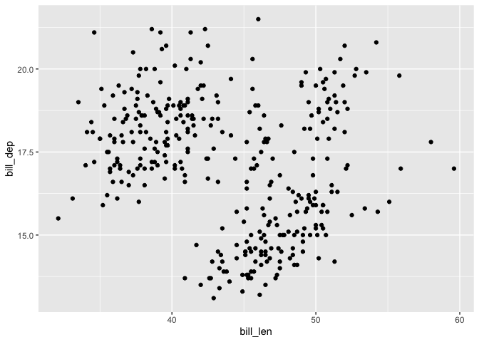
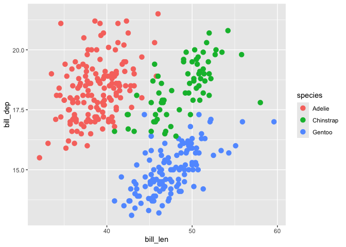
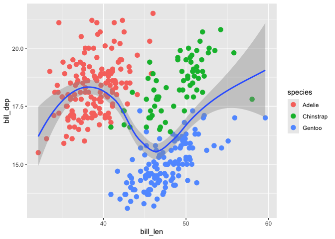
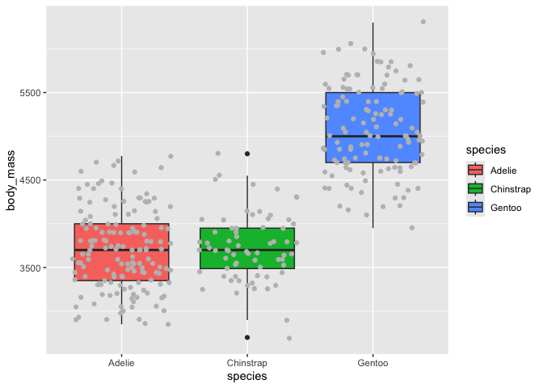
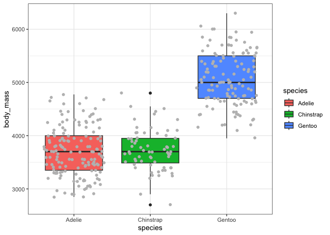
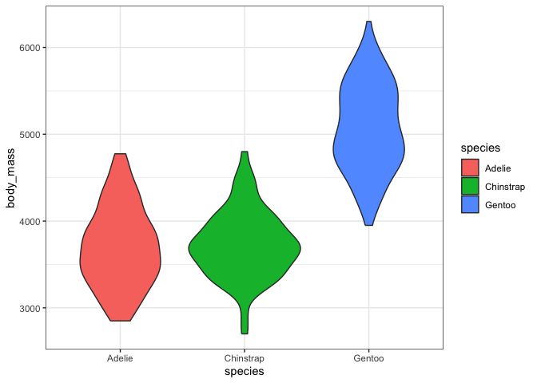

# Week 2 Problem Set


## Assignment Introduction

This week we’ve been practicing creating `ggplot2` figures and working
with Quarto documents. Your job for this assignment is to create a
Quarto document that matches the **style** and **formatting** of what
you see here. The only exception is that *you* will need to add the code
chunks that produce the figures (instead of the images that are
included)!

This week, you have two options for how to begin this Quarto document:
**(1)** Start a new Quarto document from scratch like we did in class;
or **(2)** Use the provided template (`week2_PS_template.qmd`) as a base
for your formatting and code.

Commit your final `week2_PS.qmd` and `week2_PS.md` files to the
`problem_sets` folder in your GitHub repository.

***Don’t forget to take advantage of the “Further readings” from the
lecture for help creating these more complex figures!***

**Deadline**: 10/15/25 10pm

## Practicing with `ggplot2`

Don’t forget to load the `tidyverse`! *You may note that you get
warnings/messages when you run your code–that’s okay!*

``` r
library(tidyverse)
```

### Exercise 1

This exercise explores the relationship between bill length (`bill_len`)
and bill depth (`bill_dep`) of 3 different penguin species using the
`penguins` dataset.

#### 1.1 Explore the relationship between `bill_len` and `bill_dep` with a scatterplot.

``` r
## add your code here
```



#### 1.2 Make the color of all points on the previous plot purple.

``` r
## add your code here
```


#### 1.3 Color the points in the previous plot by the `species` variable and make all points size 3.

``` r
## add your code here
```



#### 1.4 Make the size of the points in the previous plot proportional to the `body_mass` variable and set the transparency to 0.75. (Hint: look up how to use `alpha`.)

``` r
## add your code here
```


#### 1.5 That’s too busy! Instead, fit a smoothed line to all of the data in the scatterplot *from 1.3*.

``` r
## add your code here
```



#### 1.6 Fit a separate straight line for each `species` instead. (Hint: look up the different options for the `method` term in the geom for the line!)

``` r
## add your code here
```


### Exercise 2

This exercise explores the `body_mass` of 3 different penguin species
using the `penguins` dataset.

#### 2.1 Show the distribution of `body_mass` in each species using a density plot. Use different colors for each `species` and set the transparency to 0.5.

``` r
## add your code here
```


#### 2.2 Instead, show the distribution of `body_mass` in each species using a boxplot. Also show the raw data points in gray for each species in the same plot. (Hint: compare the results of `geom_point` versus `geom_jitter`)

``` r
## add your code here
```



#### 2.3 Change the background `theme` to what is shown below. (Hint: Read about “complete themes” in section 17.2 of *ggplot2: Elegant Graphics for Data Analysis*.)

``` r
## add your code here
```



#### 2.4 Instead, use a violin plot with this new theme. (Hint: let’s end by learning a new `geom`!)

``` r
## add your code here
```


